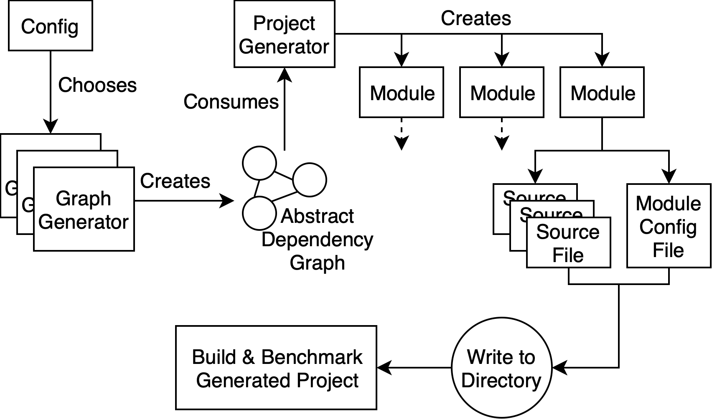

# How to Contribute

Uber welcomes contributions of all kinds and sizes. This includes everything from from simple bug reports to large features.

Before we can accept your contributions, we kindly ask you to sign our [Contributor License Agreement](https://cla-assistant.io/uber/uber-poet).

## Workflow

We love GitHub issues!

For small feature requests, an issue first proposing it for discussion or demo implementation in a PR suffice.

For big features, please open an issue so that we can agree on the direction, and hopefully avoid investing a lot of time on a feature that might need reworking.

Small pull requests for things like typos, bug fixes, etc are always welcome.

## DOs and DON'Ts

* DO read this document to understand how Uber Poet is built and how we develop.
* DO write your change to conform to our formatting, lint, import sorting, etc tools before uploading your pull request.
* DO add types if possible with new and old code.  Types help with refactoring and are unit tests you don't have to write.
* DO include tests when adding new features. When fixing bugs, start with adding a test that highlights how the current behavior is broken.
* DO keep the discussions focused. When a new or related topic comes up it's often better to create new issue than to side track the discussion.
* DON'T not copy code from websites with licenses that are incompatible with Apache 2.0. This means you cannot copy from StackOverflow, because it's Creative Commons BY-SA license which is not compatible.
* DON'T submit PRs that alter licensing related files or headers. If you believe there's a problem with them, file an issue and we'll be happy to discuss it.

## Basic Getting Started

* On a macOS 10.13+ machine, install Xcode : `xcode-select --install`
* Install [pipenv](https://pipenv.readthedocs.io/en/latest/)
* Clone the repo: `git clone https://github.com/uber/uber-patcher.git`
* Install python dependencies: `pipenv install --dev`
* Test if your pipenv setup is working by running unit tests: `pipenv run pytest`
    * You can also run longer running integration tests with `INTEGRATION=1 pipenv run pytest`
* Edit code with your favorite text editor or IDE!

## How we Develop

* We used [Visual Studio Code](https://code.visualstudio.com) at first, but then moved to [pycharm](https://www.jetbrains.com/pycharm/) because of it's code inspector, richer refactoring tools and less configuration required to do basic things like testing.  You can use any code editor you would like, but please use PyCharm's [Inspect Code](https://www.jetbrains.com/help/pycharm/running-inspections.html) before you push.
* It's a goal to eventually move this code base to python 3, probably when python 2.7 won't be maintained anymore after 2020.

Tools used for managing the code base:
* pytest for running tests, basic unittest for writing tests. Run tests with your IDE or `pipenv run pytest`.
* yapf for formatting
* isort for sorting imports
* flake8 & pylint for linting
* PyCharm's "[Inspect Code](https://www.jetbrains.com/help/pycharm/running-inspections.html)" tool  (not enforced by ci since it's difficult to use via command line)
* pipenv to manage application dependencies
* Tool configuration is kept in the `setup.cfg` file. Please use that as you develop.

I would suggest running the dev tool versions that come with the repo, to avoid issues with github actions CI not passing.  Look at the [github actions yaml](../.github/workflows/python-app.yml) to see what commands it executes.  The versions they execute although are not ones that would actually update your code to automatically fix them, so a general pre-commit workflow would be:

```bash
pipenv install --dev  #only need to run this once
INTEGRATION=1 pipenv run pytest --cov=uberpoet --cov-report xml:cov.xml --cov-report term-missing  #fix failing tests
pipenv run yapf -ri uberpoet/ test/ *py  # -r = recursive , -i = in-place, yapf is an autoformatter
pipenv run isort # isort fixes in place by default, isort = import sort
pipenv run flake8 # manually fix any issues the flake8 linter brings up
```

Make sure to check the [.travis.yml](../.travis.yml) file to see what is actually run in case this file is out of date.

## Basic App Architecture

If you were to summarize Uber Poet as some python pseudocode:

```python
def make_project(config):
    abstract_dependency_graph = config.graph_generation_function(config.project_generation_options)
    swift_file_maker = SwiftFileGenerator()
    project_gen = BuckProjectGenerator(swift_file_maker)
    project_gen.generate_project_from(abstract_dependency_graph)
    project_gen.write_to_folder(config.output_path)
    
def multisuite(config):
    original_state = save_xcode_state()
    
    for xcode_config in config.xcode_configs:
        set_xcode_state(xcode_config)
        
        for gen_func in config.graph_generation_functions:
            proj_config = ProjectConfig(gen_func, join(config.output_path, gen_func.name)
            make_project(proj_config)
            
            trace = TimeAndCPUTracer().start()
            build_project(proj_config)
            trace.stop()
            
            trace.append_result_to_csv(config, proj_config)
            
    set_xcode_state(original_state)
```



Generating a mock app consists of 3 parts:

* Generating an abstract module dependency graph that represents the mock app. (`ModuleNode` in `moduletree.py`)
* Feeding this graph into a build description generator (ex: `BuckProjectGenerator` in `projectgen.py`), which creates project config files.
* And the build description generator using a file generator (ex `SwiftFileGenerator` in `filegen.py`) creating mock code files.
* And then writing all these files into a tree of folders

Most variation & configuration resides in the graph objects that the graph generation functions create.  So the if command line says there are 50 modules or 100 modules with a [`bs_layered`](docs/layer_types.md) graph type, that will show up in the generated abstract graph. 

`GenProjCommandLine` from `genproj.py` is the UI that the user's configuration for generating a mock app is passed into the above process.

`CommandLineMultisuite` from `multisuite.py`, does the same thing as `genproj.py`, but with a list of project generators, and builds these projects and records the build times.  It also gives you configuration options in how building is done.  Multisuite also uses code in `statementmanagement.py` & `cpulogger.py` to help it manage Xcode build configuration and track CPU usage.

`dotreader.py` is used to generate dependency graphs from dot files.
