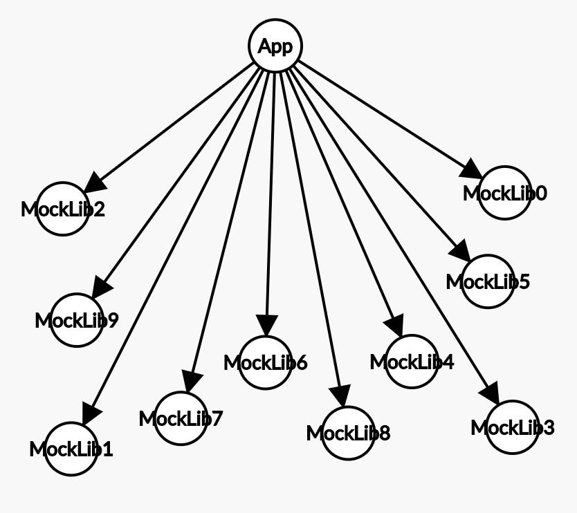
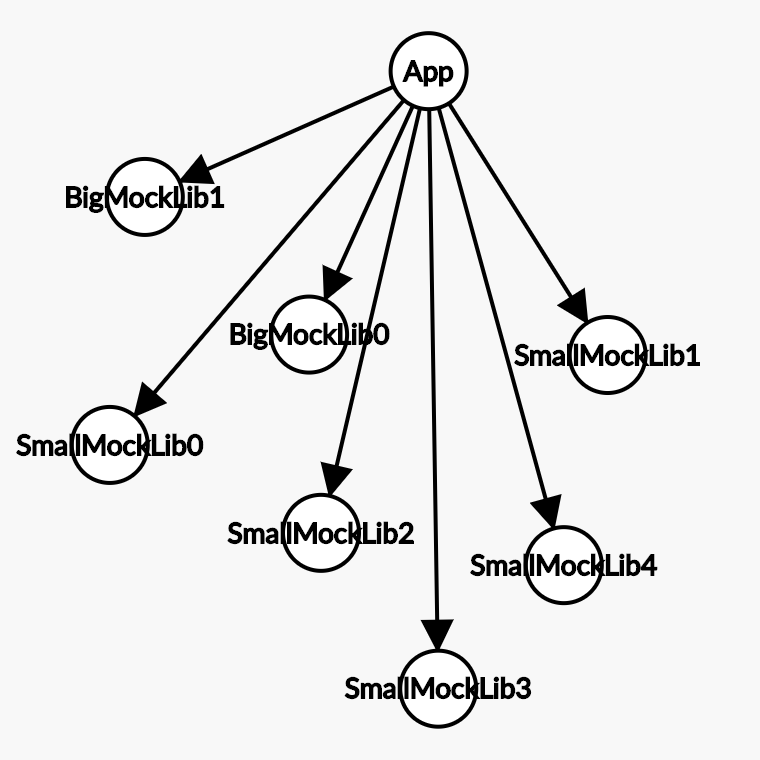
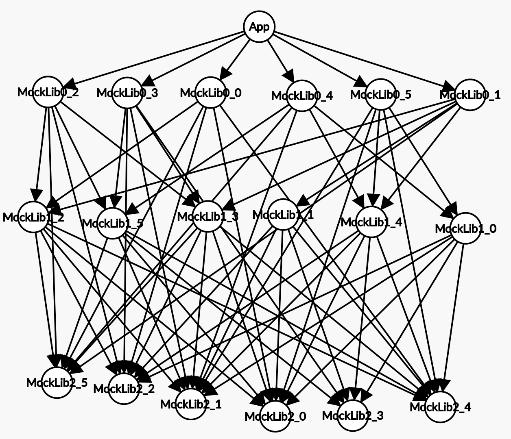
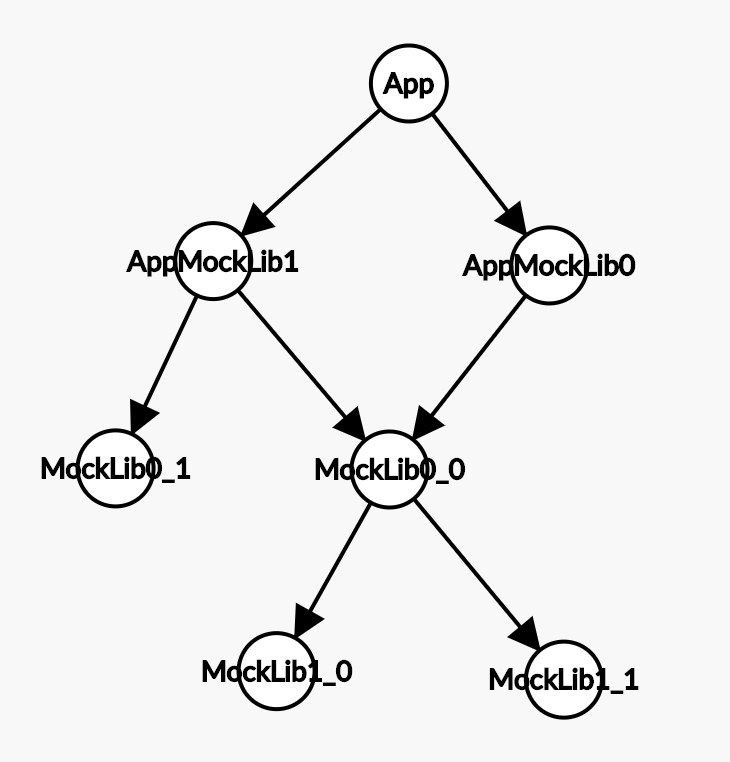

# Module Generation Graph Types

## flat

A module graph that has one app module which depends on one library layer of `module_count` modules.  Those modules do not depend on anything.

## bs_flat ("Big Small Flat")

A module graph that has one app module which depends on one library layer of modules.  Those modules do not depend on anything. Some of the modules in the library layer are 'big', the rest are small. There are `big_module_count` number of big modules, and `small_module_count` small modules.

## layered

A module graph of one app module and `app_layer_count` number of library layers. Each layer depends on a random selection of modules in lower layers. There are `module_count` number of library modules.

Due to probability a random selection of modules won't be built because they won't be connected to main module graph if the module count is large enough, since each module in a layered tree only connects to 5 other modules in a large set.

## bs_layered ("Big Small Layered")

A module graph that has one app module, one flat layer of `big_module_count` big modules and `layer_count` layers of `small_module_count` modules under the big module layer which connect to random modules inside like the layed module graph type.

Due to probability a random selection of modules won't be built because they won't be connected to main module graph if the module count is large enough, since each module in a layered tree only connects to 5 other modules in a large set.

## dot
Reads a dot file specified at `dot_file_path` which represents a dependency graph of code modules.  Picks `dot_root_node_name` as the app node to generate the app from.  You can generate a dot graph of your own buck app by using something like `buck query "deps(//apps/myapp:App)" --dot > file.gv`.  Every module in a dot graph mock app is the same size, unlike most applicaitons.  Future improvements could co-relate this dot graph with a lines of code file database and directory structures to make proportional modules sizes.